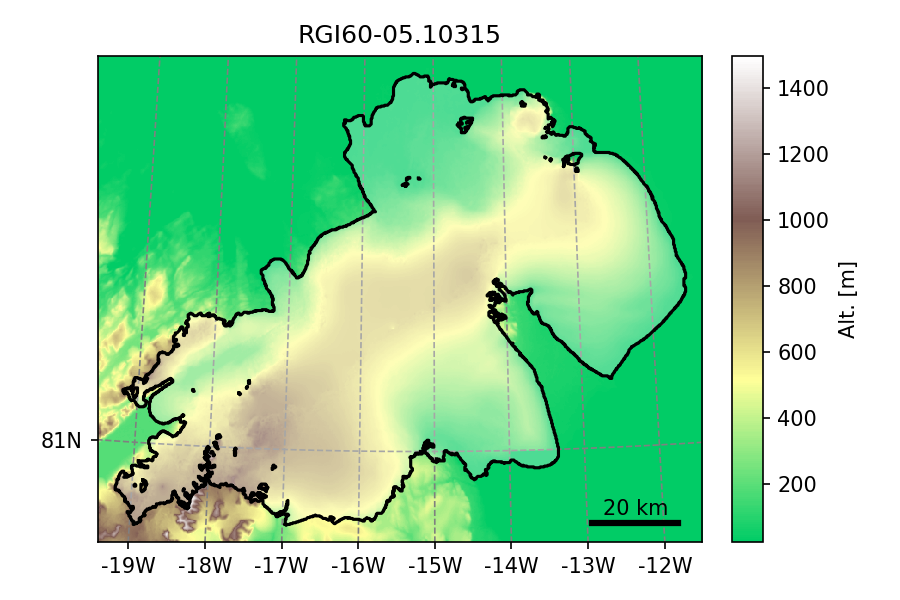
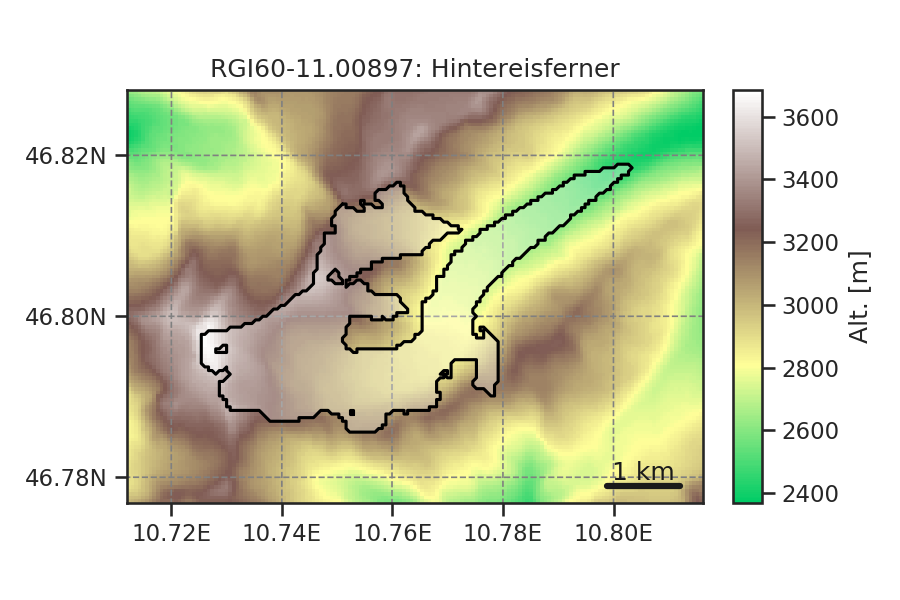
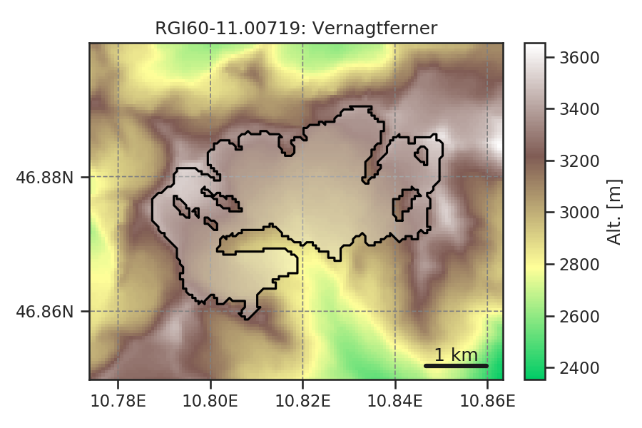

Known issues in RGI V6
======================

This page lists the issues that have been discovered in RGIV6.

Data files
----------

- The file ``01_rgi60_Alaska_hypso.csv`` contains RGI IDs which are still labelled
  as RGI50.
- The column ``Zmed`` in the file '19_rgi60_AntarcticSubantarctic.shp' contains
  only missing data
- the file ``08_rgi60_Scandinavia.shp`` is located in a folder wrongly entitled
  ``07_rgi60_Scandinavia``.
- the file ``04_rgi60_ArcticCanadaSouth.shp`` is located in a folder
  wrongly entitled ``04_rgi60_ArcticCanadaNorth``.
- in the `summary file <http://www.glims.org/RGI/rgi60_files/00_rgi60_summary.zip>`_,
  the RGI subregions of Region 08 (Scandinavia) are wrongly named and the
  subregion 08-03 as defined in the technical report is missing.
- the files `00_rgi60_O1Regions.shp` and `00_rgi60_O2Regions.shp` contain
  polygons describing the boundaries of all RGI regions and subregions.
  149 RGI glaciers do not pass the geometrical test:
  `reg_region.contains(rgi_center_point)`.

Undivided glacier complexes
---------------------------

Large, undivided glacier complexes are the major obstacle towards distributed
flowline modelling at the global scale. Here we will list the major glacier
complexes that need to be divided.

A prominent example is glacier ``'RGI60-05.10315'`` an ice-cap in
north-east Greenland and also the largest RGI entity (by far) with
7537 km :math:`^2`:

Other examples include glacier complexes which have been merged into one
glacier entity for historical reasons. For example, Hintereisferner
and Vernagtferner in the Austrian Alps should actually be divided into
several entities:

Noisy DEM data
--------------

RGI does not currently ship DEM data directly, but only as aggregated,
hypsometry statistics. We know however that these statistics might rely
on a noisy DEM map (see `this blog post <https://oggm.org/2018/05/21/g2ti/>`_
for more information). This is very unlikely to have any significant
influence on the aggregated statistics, since the DEMs are mostly correct and
just noisy.
